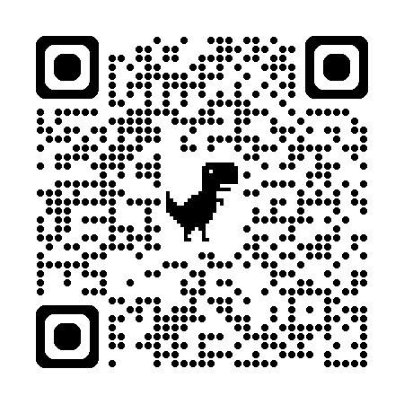
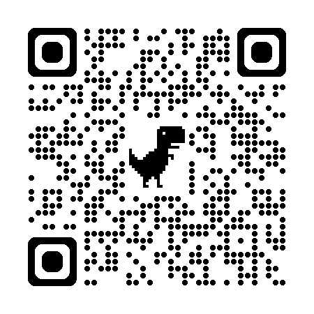
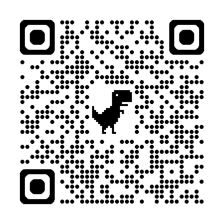
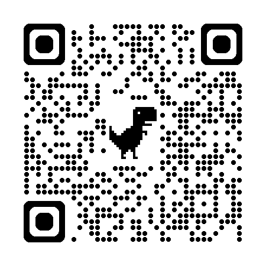
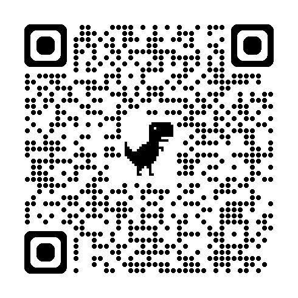
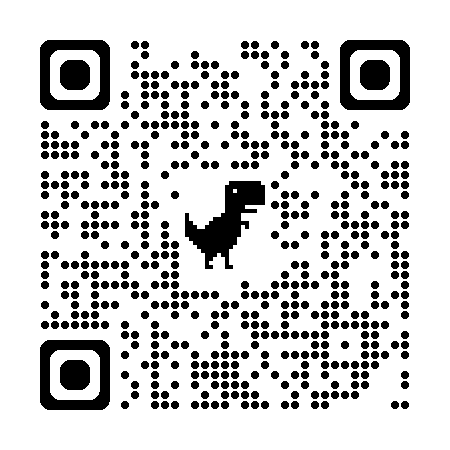
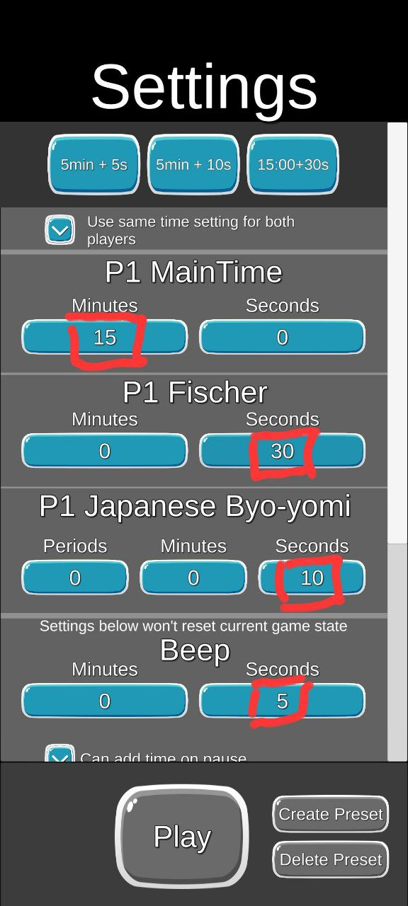
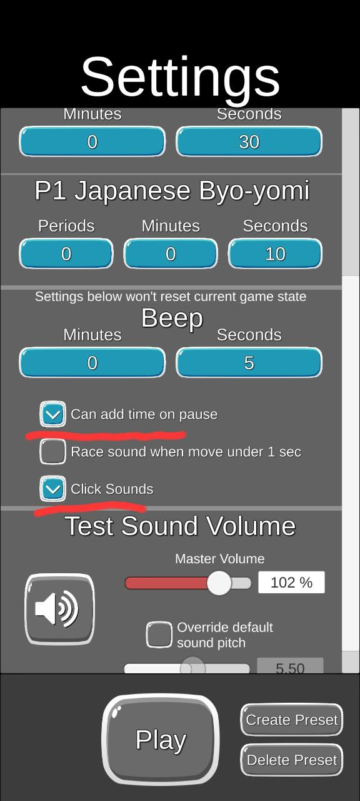

# สำหรับ เจ้าหน้าที่


### ใบลงผลคะแนนหมากล้อม

[ใบลงผลคะแนนหมากล้อม](https://docs.google.com/spreadsheets/d/1-F2hyJB1SHmMLmnSvHst9S992OJ4Uqza/edit?usp=sharing&ouid=104579028883770071997&rtpof=true&sd=true)


```

🎯 สรุปจำนวนใบที่ต้องพิมพ์

✅ สรุปยอดรวม:

ใบลงผลคะแนนแบบที่ 1 = 72 ใบ
ใบลงผลคะแนนแบบที่ 2 = 24 ใบ
รวมทั้งหมด = 96 ใบ

```


### ประกาศการจับคู่ และ ผลการแข่ง

...

user: khemphed.retail@gmail.com

pass: 83JwDjSYg6!dZy

...

[กีฬาหมากล้อม ระดับจังหวัด ณ วอศ สระบุรี ประเภทบุคคลชาย](https://swisssystem.org/tournament/bb05931cb4014b3b896c29122c595a3b/standings)

...



...

...

...


[กีฬาหมากล้อม ระดับจังหวัด ณ วอศ สระบุรี ประเภทบุคคลหญิง](https://swisssystem.org/tournament/54bea1bbb701440e9af8634bdf173185/standings)

...



...

...

...


[กีฬาหมากล้อม ระดับจังหวัด ณ วอศ สระบุรี ประเภทคู่ผสม](https://swisssystem.org/tournament/3d95a6a7477043f5a7350c031521b062/standings)

...



...

...

...


[กีฬาหมากล้อม ระดับจังหวัด ณ วอศ สระบุรี ประเภททีมผสม (3v3)](https://swisssystem.org/tournament/2311ef5752a442a7910f0339129737fa/standings)

...



...

...

...


### วิธีการนับแต้ม


https://youtu.be/gTlViBJAcSQ?si=hACeYS0uC01vPM9J


https://youtu.be/UP2tEUpvESg?si=IajIFoc-BXs6gPNP


https://youtu.be/6aVep9JK7g8?si=7bNXSI0rLUuECj35


https://youtu.be/ssetxt1wUeA?si=xClzfGoeyqBM5o3k


...

### โปรแกรม นาฬิกา

[Go/Chess Clock with sounds Android](https://play.google.com/store/apps/details?id=com.parseri.goclock&pcampaignid=web_share)

...



...

...

[Go/Chess Clock with sounds IPhone](https://apps.apple.com/th/app/go-chess-clock-with-sounds/id1658323608?l=th)

...



...

#### การตั้งค่านาฬิกา เลือกตามภาพดังต่อไปนี้




...




### โปรแกรมบันทึกคะแนนและรวมผล

https://v-go-committee.vercel.app/


```

ประเภท

  บุคคลชาย

  บุคคลหญิง

  คู่ชาย

  คู่หญิง

  คู่ผสม

  ทีมชาย

  ทีมหญิง

  ทีมผสม

```

